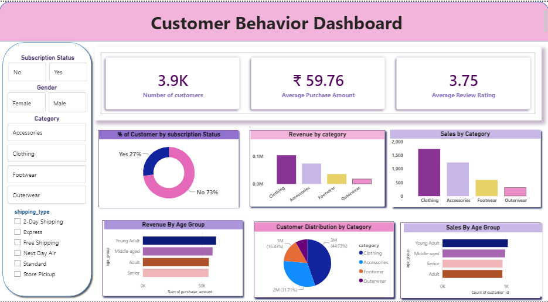

Here is your updated `README.md` file with **MySQL** replacing PostgreSQL and **Dashboard_new.png** used for your dashboard image:

---

```markdown
# 🛒 Customer Shopping Behavior Analysis

An end-to-end data analytics project exploring transactional data across 3,900 customer purchases[cite: 1]. This project utilizes **Python (Pandas)** for data cleaning and EDA[cite: 1], **MySQL** for database management and business query execution[cite: 1], and **Power BI** for interactive visual reporting[cite: 1].

---

## 📊 Interactive Dashboard Preview



---

## 📌 Project Overview
The objective of this analysis is to uncover key insights into customer spending patterns, subscription habits, product category performance, and demographic trends to drive actionable business decisions[cite: 1].

### Key Metrics & Highlights
* **Total Transactions:** 3,900 records[cite: 1]
* **Average Purchase Amount:** ~$59.76[cite: 1]
* **Average Review Rating:** 3.75 / 5.0[cite: 1]
* **Subscriber Conversion:** 27% Subscribed | 73% Non-Subscribed[cite: 1]

---

## 🛠️ Data Pipeline & Workflow


```

[ Raw Dataset ] ➡️ [ Python (EDA & Imputation) ] ➡️ [ MySQL ] ➡️ [ Power BI Dashboard ]

```

### 1. Data Cleaning & Feature Engineering (Python)
* **Missing Value Imputation:** Filled missing `Review Rating` values using category median ratings[cite: 1].
* **Feature Engineering:** 
  * Created `age_group` binning (Young Adult, Middle-aged, Adult, Senior)[cite: 1].
  * Calculated `purchase_frequency_days`[cite: 1].
* **Consistency:** Dropped redundant `promo_code_used` column after validating against `discount_applied`[cite: 1].

### 2. Database Integration & SQL Queries (MySQL)
Loaded cleaned data into MySQL to answer core business questions[cite: 1]:
* **Revenue Breakdown:** Male vs. Female customer contributions[cite: 1].
* **Customer Segmentation:** Classified shoppers into *New*, *Returning*, and *Loyal* tiers[cite: 1].
* **Discount Dependency:** Identified top products heavily reliant on promotional discounts[cite: 1].
* **Top Performing Products:** Ranked products by category using window functions (`DENSE_RANK()`)[cite: 1].

### 3. Data Visualization (Power BI)
Built a dynamic dashboard with custom slicers for *Subscription Status*, *Gender*, *Category*, and *Shipping Type*[cite: 1].

---

## 💡 Key Business Insights

1. **Category Champions:** Clothing and Accessories generate the highest overall sales volume and revenue[cite: 1].
2. **Subscription Opportunity:** Only 27% of shoppers are subscribers, yet repeat purchasers show strong loyalty[cite: 1].
3. **Demographic Reach:** Young Adults lead in overall spend contribution, followed closely by Middle-aged shoppers[cite: 1].
4. **Discount Sensitivity:** Items like Hats, Sneakers, and Coats see over 48% of purchases made with discounts[cite: 1].

---

## 🚀 Strategic Recommendations

* 🎯 **Boost Subscriptions:** Introduce exclusive subscriber perks or first-purchase discounts to convert the 73% non-subscriber base[cite: 1].
* 💎 **Loyalty Rewards:** Expand loyalty incentives for repeat buyers (>5 purchases) to improve customer retention[cite: 1].
* ⚖️ **Discount Optimization:** Adjust pricing and discount strategies on high-demand items to protect profit margins[cite: 1].
* 📢 **Targeted Marketing:** Direct seasonal ad spend toward high-value age brackets (Young Adults/Middle-Aged)[cite: 1].

---

## 💻 Tech Stack
* **Language:** Python 3.x (Pandas, PyMySQL / SQLAlchemy)[cite: 1]
* **Database:** MySQL / MySQL Workbench[cite: 1]
* **Visualization:** Power BI Desktop[cite: 1]
* **Documentation:** Markdown

```
